# 🏴‍☠️ SOS : Sea of Secrets

## ✨서비스 설명

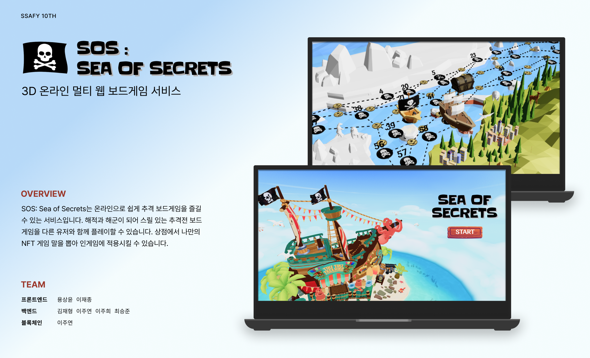

### 개요 🧾

- 해적과 해군의 쫓고 쫓기는 **추리/추격 온라인 보드 게임**!
- 서비스 명 : **SOS: Sea of Secrets**

### 주요 기능 💡
- `게임` 온라인으로 사람들과 함께 추격/추리 보드 게임을 즐기자!
- `상점` 획득한 골드로 나만의 NFT 말을 획득하자!
- `NFT` NFT 지갑을 발행받고, 획득한 게임 말을 나의 지갑에서 확인해보자!

## 🎞️ UCC

**↓ 클릭 후 UCC 페이지로 이동**

[](https://youtu.be/BRsZ-QLNDRM)

해적과 해군의 쫓고 쫓기는 추리/추격 온라인 보드 게임! SOS: Sea of Secrets의 UCC입니다.

## 🏆 수상

- 🥇 SSAFY 10기 특화프로젝트 최우수상(1등)

## 🔎 서비스 소개

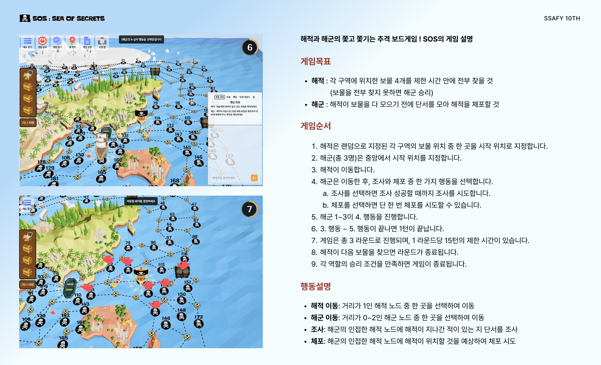
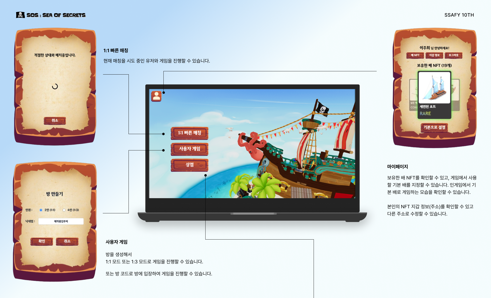
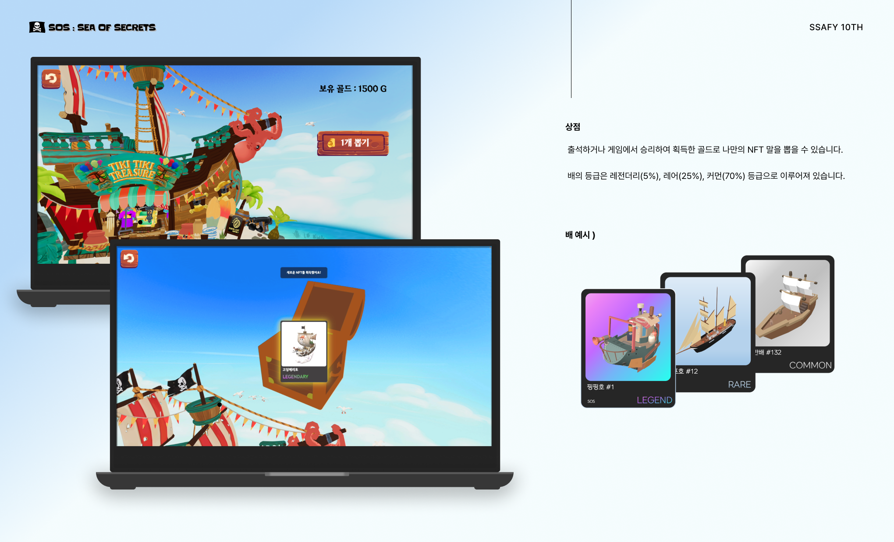

## 🖥️ 화면 예시
|렌더링|상점|
|:--:|:--:|
||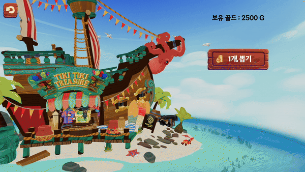|
|**마이페이지**|**사용자게임**|
|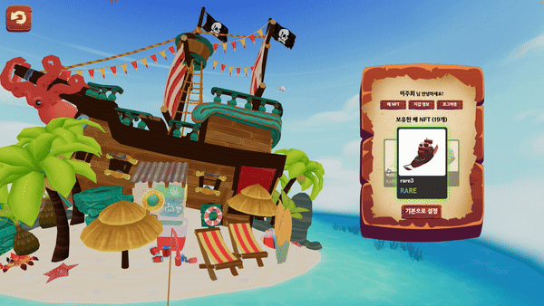|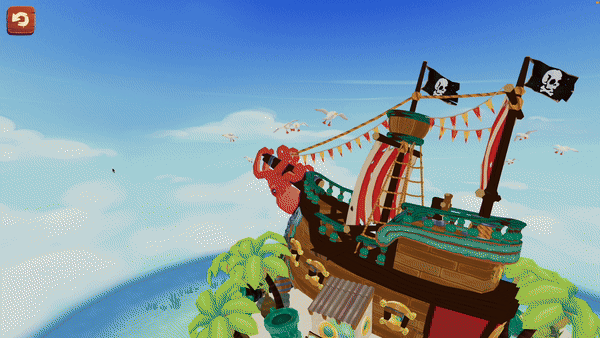|
|**인게임(시작 위치)**|**인게임(이동)**|
||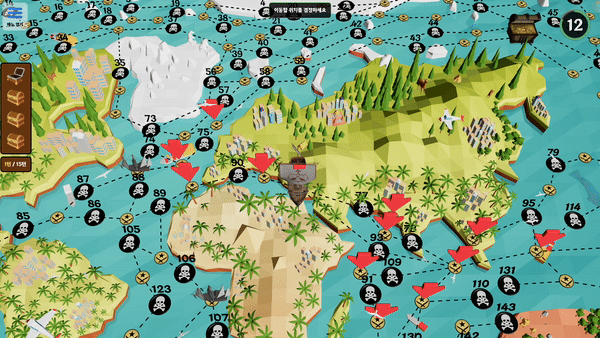|
|**인게임(조사)**|**인게임(체포)**|
|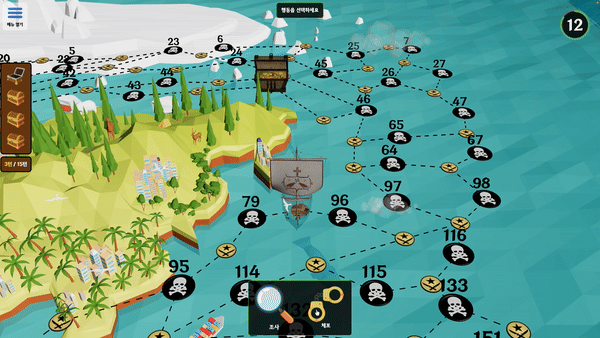|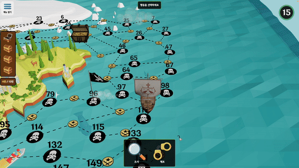|


## ⚒️ 기술 소개
### 개발환경
|분류|도구 및 버전|
|:---|:---|
|OS|- Local : Windows 10 <br> - AWS : Ubuntu 20.04.4 LTS|
|IDE|- IntelliJ IDE 2023.3.2 <br> - Visual Studio Code 1.70.0|
|UI/UX|- Figma|
|Database|- MySQL workbench 8.0.20 (Windows 10) <br> - MariaDB <br> - MongoDB <br> - Redis
|CI/CD|- Jenkins|

### 사용 언어 및 라이브러리
|분류|이름 및 버전|
|:---|:---|
|**Frontend**|- npm: >=9 <br> - node: >=18 <br> - TypeScript: >=5 <br> - React: >=18 <br> - Next.js: >=14 <br> - Three.js: 0.162.0 <br> - @stomp/stompjs: 7.0.0 <br> - Zustand: 4.5.2 <br> - sass: 1.71.1 <br> - @emotion/react: 11.11.4, @emotion/styled: 11.11.0 <br> - prettier: 3.2.5 <br> - eslint: >=8 <br> - jest: >=29 <br> - leva: 0.9.35|
|**Backend**|- JAVA (Zulu 17) <br> - Gradle 8.5 <br> - SpringBoot 3.2.1 <br> - JPA <br> - Lombok 1.18.20 <br> - security6, oauth-client2, jjwt 0.11.5 <br> - JUnit5 <br> - Stomp 2.3.4|
|**Blockchain**|- node.js 18.17 <br> - ethers.js 6.11.1 <br> - express 4.18.3 <br> - NFT.storage 7.1.1 <br> - web3 4.6.0 <br> - blocksdk-js 3.1.0|
|**Smart Contract**|- @chainlink/contracts 0.2.1 <br> - hardhat 2.11.0 <br> - openzeppelin/contracts 5.0.0 <br> - openzeppelin-solidity 2.2.0 <br> - mocha 9.2.1|

### 협업 툴
|분류|도구|
|:---|:---|
|이슈 관리|- Jira|
|형상 관리|- GitLab <br> - Git|
|커뮤니케이션|- Notion <br> - Mattermost <br> - Discord|

### 아키텍처 다이어그램
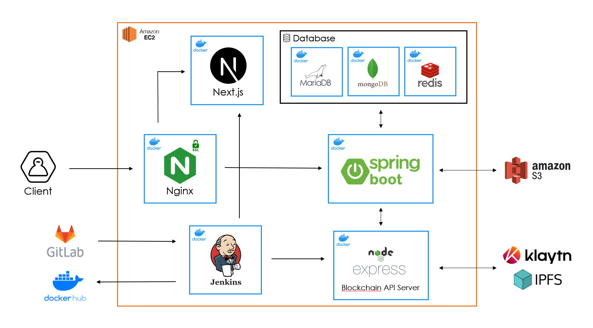

### Git Commit 컨벤션

- `feat` : 새로운 기능 추가
- `fix` : 버그 수정
- `docs` : 문서 내용 변경
- `style` : 포맷팅, 세미콜론 누락, 코드 변경이 없는 경우 등
- `refactor` : 코드 리팩토링
- `test` : 테스트 코드 작성
- `chore` : 빌드 수정, 패키지 매니저 설정, 운영 코드 변경이 없는 경우 등

```
type: subject

ex) 회원가입 기능

- feat: Join in #Jira Issue Number
```

### Git Branch 전략

- `master`
- `develop`
- `feat/fe/function1`
- `feat/be/function2`

### ERD
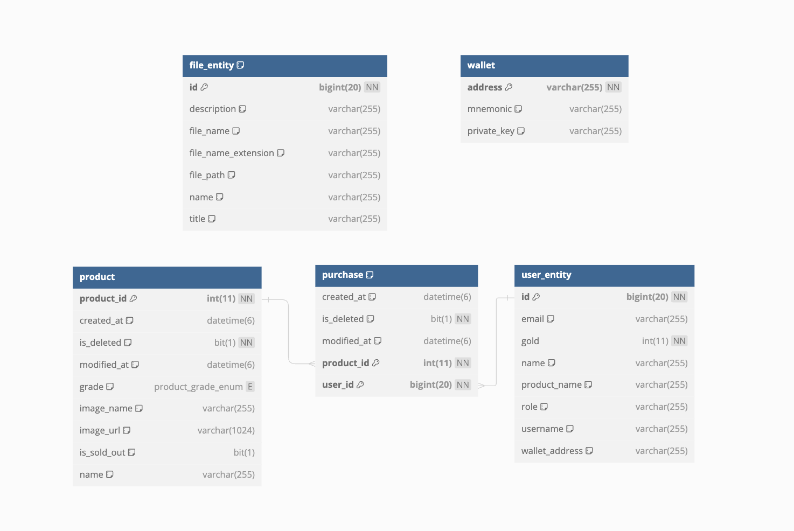

### EC2 포트 정리

| Port |                      |
| ---- | -------------------- |
| 8080 | Jenkins      |
| 8081 | Spring boot      |
| 80   | nginx HTTP 기본 포트 |
| 443  | nginx HTTPS          |
| 3306 | MariaDB                |
| 3000 | Next.js app            |
| 4000 | Express.js app            |


## 팀원
|**김재형**|**용상윤**|**이재종**|**이주연**|**이주희**|**최승준**|
|:--:|:--:|:--:|:--:|:--:|:--:|
|BE(게임엔진)|FE(상점)|FE(인게임)|BE(마이페이지) <br> 블록체인|BE(게임엔진) <br> 팀장|BE(상점)<br> 인프라|
